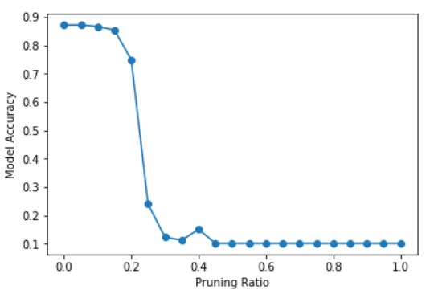

# HW13 Network Compression
## Task description:

* Network Compression: Make your model smaller without losing the performance. 
* Knowledge Distillation - Train a small model(student model) with teacher model, small model can learn better. 
* Use Depthwise and Pointwise Convolution to reduce the model parameters.(parameters<10k) 
* Train an image classifier to classify the kind of food.  
* Network pruning  

---------------------------------------
## Some methods to be used:  
* Residual learning
* move some validation set to training set --> train : 12796, valid : 500
* Using data augmentation like HW3, instead of putting all Data augmentation methods in begin, put one by one in gradually.
---------------------------------------
## How to Reproduce the best result
Open the Google Colab 
Upload the「ML2022Spring_HW13_ipynb」的副本  

## Replenishment
* You can't directly run the code, download the data is required.
* Watch out the file directory, and have to load the checkpoint successfully.
